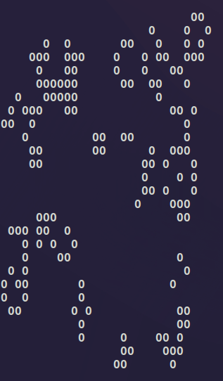
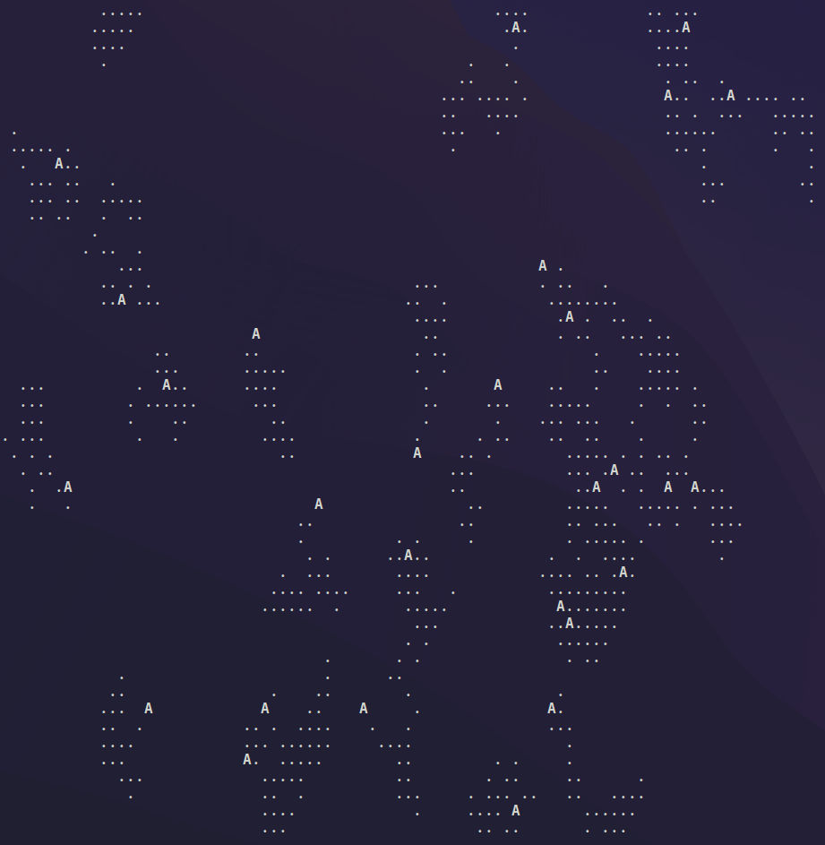

# Emergent Behavior

https://en.wikipedia.org/wiki/Emergence

https://en.wikipedia.org/wiki/Abstraction

- exploring emergent behaviors in robotics and nature
- need to find mathematical rules for emergent behavior, especially in robots interacting in dynamic environments
- how can robots learn and generalize like a baby? mix of nature (genetic encoding) and nurture (environment)
- looking at natural systems for inspiration, like ant colonies - simple individual actions leading to complex group behavior
- building some intuition by studying conway's game of life for patterns from simple rules... although it's quite mesmerizing lol
- thinking about applying these concepts to physical robots - how they learn, adapt, and make decisions based on environment and interactions with people

## Conway's Game of Life

## Ant Colony

